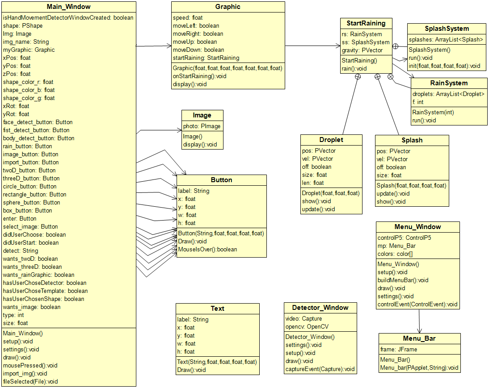

# 1984-generative-graphics
This project involves combining conventional projection mapping technology in combination with generative-computer graphics and computational vision, in order to create a completely fluid and projected environment for actors in plays. This is a desktop application for the streamlining of generative graphics creation essentially a User Interface tool that will be used to track actor movements on stage and generate graphics to augment the scene or actually create entirely new interactive environments. A primary goal for this novel software tool is that it allows for the quick alteration of perimeters in generative algorithms, enabling theatrical scenic designers to edit and design in real time during rehearsal, thus creating the conditions for a more fully integrated and collaborative design process with the director, actors, and other designers. 

# Technologies Used
The application is now being developed using [Processing](https://processing.org/) software.

* [Download Processing](https://processing.org/download/)

### Why Processing? (source from website https://processing.org)

Processing is a flexible software sketchbook and language for learning how to code within the context of the visual arts. Since 2001, Processing has promoted software literacy within the visual arts and visual literacy in technology. It is widely used for learning and prototyping.

* Free to download and open source.
* Interactive programs with 2D, 3D, PDF, or SVG output.
* OpenGL integration for accelerated 2D and 3D.
* For GNU/Linux, Mac OS X, Windows, Android, and ARM.
* Over 100 libraries that extend the core software.
* Well documented, with many books available.

### Why we switched techology?

* Earlier approach had lot of dependencies and thus a lot of additional installations required.
* High hardware requirements.
* Complex to use and learn as compared to Processing.
* Compatability issue between openpose and openframeworks.
* Processing is ready to use, one just needs to download the application.

### Technologies Used in Old Code
* [openpose](https://github.com/CMU-Perceptual-Computing-Lab/openpose)
* C++
* [openframeworks](https://openframeworks.cc/about/)

Code and documentation could be found in old directory

### How to run

1. [Download](https://processing.org/download/) Processing.

2. Install the above listed libraries.

    To install library, in IDE go to: 
    Sketch -> Import Libarary -> Add Library
    
    If any supporting library for the application is missing, errors could be seen in the IDE console. In that case install those libraries as well.

3. Copy "fist.xml" file to:

    ..\Processing\libraries\opencv_processing\library\cascade-files\

    File could be found in "main_window" directory. It detects actor's fist.

4. Double click on the file "main_window.pde" in the directory "processingproj/main_window" and run using play(green) button in IDE. 

5. Applictaion should start with a gui with different sliding bars to customize the graphic and a startup window will appear with selections that the user can choose from, such as shapes, template, and which movement to detect. After the user has chosen the necessary information, the graphics window will appear along with a window displaying the camera and what it is detecting. 

    Happy playing!!

### For more information about the code, code structure, the source material that we used, and issues that we faced, please consult the README.md in the "processingproj" folder.

### Project UML

This is a high level UML to get a quick insight of the project.

