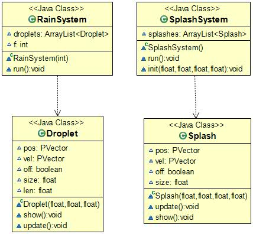

This directory contains test codes which we designed while development. These codes are implementing particular feature and could be helpful in understanding the code in main application.

## About Files
* DetectAndStartCamera - Code written using classes following OOPS approach to detect camera
* detector - Code made in attempt to integrate UI and 3D rain, ERROR code as UI is 2D and rain code is 3D
* RainScene3D - Code to generate 3D rain sourced from [here](https://discourse.processing.org/t/simple-3d-rain-simulation/10834)
* RainSceneWithHumanDetection - Code generating 3D rain graphics and detecting actor. We were trying to create a 3D rain environment for the play, in which actors could be detected. For now it does not show rain graphics where actor is located. Later we will improvise it to detect umbrella and block rain graphics accordingly.

## To run

Code can be run like a normal .pde files assuming Processing application exits.

## Class Structure 

* Rain Scene (Directory - RainScene3D)

* Rain Scene With Human Detection (Directory - RainSceneWithHumanDetection)

